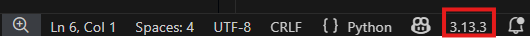

# Proyecto asociado al paper "A Q-learning approach for long-term hydrothermal dispatch"

Este repositorio contiene el código, datos y resultados correspondientes al proyecto asociado al paper **"A Q-learning approach for long-term hydrothermal dispatch"**.  

---

## Estructura del repositorio

### TODO: ESCRIBIR ESTO, EXPLICANDO QUÉ ES CADA CARPETA Y ARCHIVO

## Configuración y Ejecución

1. **Clonar el repositorio:**
  ```bash
   git clone https://github.com/florencia-roque/RL_optimal_dispatch.git

   cd RL_optimal_dispatch
  ```

2. **Configuración del Entorno (opcional pero recomendado)**
Se recomienda el uso de un entorno virtual para evitar conflictos de dependencias:
Para que permita la creacion de entorno virtual antes ejecutar:
  ```bash
  Set-ExecutionPolicy -ExecutionPolicy RemoteSigned -Scope CurrentUser
  ```

*Windows:*
  ```bash
  python -m venv .venv
  .\.venv\Scripts\activate
  ```
*Linux/Mac:*
  ```bash
  python3 -m venv .venv
  source .venv/bin/activate
  ```

 Luego, hay que seleccionar este entorno virtual para trabajar ahí. Para ello abrir un archivo .py (para que ver el botón que muestra la versión de Python instalada) abajo a la derecha, como se muestra en la siguiente foto:



Elegir la opción de .venv, ver foto a continuación:


3. **Instalar dependencias:**
Las mismas se instalarán desde el archivo que las tiene detalladas usando el siguiente comando:
  ```bash
  pip install -r requirements.txt
   ```    

4. **Dos maneras para ejecutar**

* Ejecutar con VS Code (recomendado):
  * Abre el proyecto en VS Code.
  * Presiona F5 para debug o Ctrl+F5 para Run sin debug.
  * Selecciona el algoritmo y los parámetros en el menú que aparece en la parte superior.

* Ejecutar desde Terminal: 

 Si no usas VS Code puedes ejecutar con el siguiente comando desde la raíz del proyecto.

 ```bash
python -m main --alg ppo --mode train
```   

Convenciones actuales del proyecto
---------------------------------
- Entrenamiento: siempre MODO='markov'.
- Evaluación:
    * si el env es determinístico (DETERMINISTICO==1): se evalúa en la misma tira
      (no corresponde pedir modo por consola).
    * si el env es estocástico (DETERMINISTICO==0): se puede evaluar en 'markov'
      o 'historico'.

Wrappers del entorno.
---------------------------------
Regla práctica:
- Todo lo que sea una transformación *del entorno Gym* (obs/action/reward) va en src/environment/wrappers.py.
- Todo lo que sea utilitario tabular (encode/decode bins, etc.) va en
  src/environment/utils_tabular.py.


Tools extra.
---------------------------------
Actualmente en desuso esos archivos (26/12/2025). De momento se guardan para eventualmente reciclar código.

---

## Autores

- Florencia Roque 
- Matías Rama  
- Ignacio Salas 
- Mónica Carle
- Magdalena Irurtia
- Rodrigo Porteiro