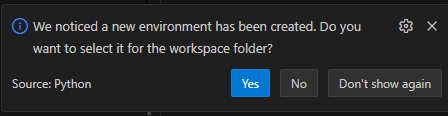

# Implementación presentada en el paper "A Q-learning approach for long-term hydrothermal dispatch"

Este repositorio contiene el código, datos y resultados correspondientes al proyecto asociado al paper **"A Q-learning approach for long-term hydrothermal dispatch"**.  

---


## Configuración y Ejecución

1. **Clonar el repositorio:**
  ```bash
   git clone https://github.com/florencia-roque/RL_optimal_dispatch.git

   cd RL_optimal_dispatch
  ```


2. **Configuración del Entorno Virtual (opcional pero recomendado)**
Se recomienda el uso de un entorno virtual para evitar conflictos de dependencias. 

Es un espacio aislado donde se pueden instalar paquetes y dependencias sin afectar la instalación global de Python ni otros proyectos.

Los siguientes comandos ejecutarlos en una consola dentro de VS Code.

Para que permita la creacion de un entorno virtual, ejecutar primero:
  ```bash
  Set-ExecutionPolicy -ExecutionPolicy RemoteSigned -Scope CurrentUser
  ```

A continuación ejecutar:

  ```bash
  python -m venv .venv
  ```

Aparecerá una ventana que pregunta si se desea seleccionar el entorno virtual creado para el espacio de trabajo actual.



Clickeamos en Yes.

Y por último hay que ejecutar:

  ```bash
  .\.venv\Scripts\activate
  ```
En la terminal se indica que esta activado el entorno con el texto: "(.venv)" antes de la ubicacion del proyecto.

3. **Instalar dependencias:**
Las dependencias se encuentran detalladas en el archivo requirements.txt

Se instalarán desde el archivo mencionado usando el siguiente comando:
  ```bash
  pip install -r requirements.txt
   ```    
Verificar que se llame al comando en una terminal con el entorno activado (.venv)


4. **Dos maneras para ejecutar**

* Ejecutar con VS Code (recomendado):
  * Abre el proyecto en VS Code.
  * Presiona F5 para debug o Ctrl+F5 para Run sin debug.
  * Selecciona el algoritmo y los demas parámetros desde el menú que aparece en la parte superior.

* Ejecutar desde Terminal: 

 Si no usa VS Code, puede ejecutar con los siguientes comandos desde la raíz del proyecto **(tener en cuenta que los comandos de configuración de entorno virtual fueron dados para VS Code, sin embargo puede utilizar la herramienta de su comodidad para ese fin)**.

*Entrenamiento:*  

 ```bash
python -m main --alg ql --mode train --total-episodes 3000
```   
*Evaluación:*  

 ```bash
python -m main --alg ql --mode eval --mode-eval historico
``` 

*Entrenamiento y evaluación:*
 ```bash
python -m main --alg ql --mode train_eval --total-episodes 3000 --mode-eval historico
```   

Convenciones actuales del proyecto
---------------------------------
- Entrenamiento: siempre MODO='markov'.
- Evaluación:
    * si el env es determinístico (DETERMINISTICO==1): se evalúa en la misma tira
      (no corresponde pedir modo por consola).
    * si el env es estocástico (DETERMINISTICO==0): se puede evaluar en 'markov'
      o 'historico'.

Wrappers del entorno.
---------------------------------
Regla práctica:
- Todo lo que sea una transformación *del entorno Gym* (obs/action/reward) va en src/environment/wrappers.py.
- Todo lo que sea utilitario tabular (encode/decode bins, etc.) va en
  src/environment/utils_tabular.py.


Estructura del repositorio.
---------------------------------

Listado del contenido del repositorio con una breve explicación de cada ítem.

.github/CODEOWNERS<br>
Define quién puede aprobar pull requests, archivo que usa github/CODEOWNERS
***

.venv<br>
Corresponde al entorno virtual de Python del proyecto.  
Contiene una instalación aislada de Python junto con todas las dependencias necesarias para ejecutar el proyecto, sin afectar el entorno global del sistema.
***

.vscode<br>
Contiene archivos de configuración específicos del proyecto para Visual Studio Code.  
Permite mantener una configuración consistente del entorno de desarrollo entre distintos desarrolladores y máquinas.
***

data/processed/aporte_claire.csv<br>
data/processed/hidrologia_claire.csv<br>
data/processed/matrices_markov_claire.csv<br>
Datos de entrada para modelar la hidrologia. Se parte de datos historicos, se clasifican en clases y se construyen matrices de transicion entre clases. 
***


data/raw/claire/datosProcHistorico.xlt<br>
data/raw/markov/Entradas/<br>
data/raw/markov/Salidas/<br>
data/raw/markov/aporte_historico_claire.xlsx<br>
data/raw/markov/Entradas/<br>
data/raw/mop<br>
Datos de entrada deterministicos
***

docs/select_env.png<br>
Imagenes del proyecto
***


results/figures<br>
results/models<br>
Ubicacion donde se alojan los resultados del proyecto
***

src/enviroment<br>
Codigo destinado a preparar los diferentes entornos dependiendo del algoritmo usado 
***

src/evaluation<br>
Guarda los outputs de evaluación:
    - trayectorias (df_avg)
    - energías, estados, resultados_agente, costos
    - escenarios individuales 
***

src/preprocessing<br>
Codigo usado para preparar datos usados en la hidrologia del embalse Claire
***

src/rl_algorithms<br>
Clases usadas para entrenar y evaluar los 3 algoritmos usados en el proyecto
***

src/utils<br>

***

tools/extra<br>
Actualmente en desuso esos archivos (26/12/2025). De momento se guardan para eventualmente reciclar código.
***


tools/visualizadorCronica.py<br>
tools/visualizar_tunning.py<br>
Herramientas para visualizar datos generados en el proyecto
***


.gitignore<br>
Configuracion que permite excluir archivos del repositorio
***


main.py<br>
Archivo principal que da inicio a la aplicación
***


requirements.txt<br>
Listado de librerias que usa el proyecto


---

## Autores

- Florencia Roque 
- Matías Rama  
- Ignacio Salas 
- Mónica Carle
- Magdalena Irurtia
- Rodrigo Porteiro